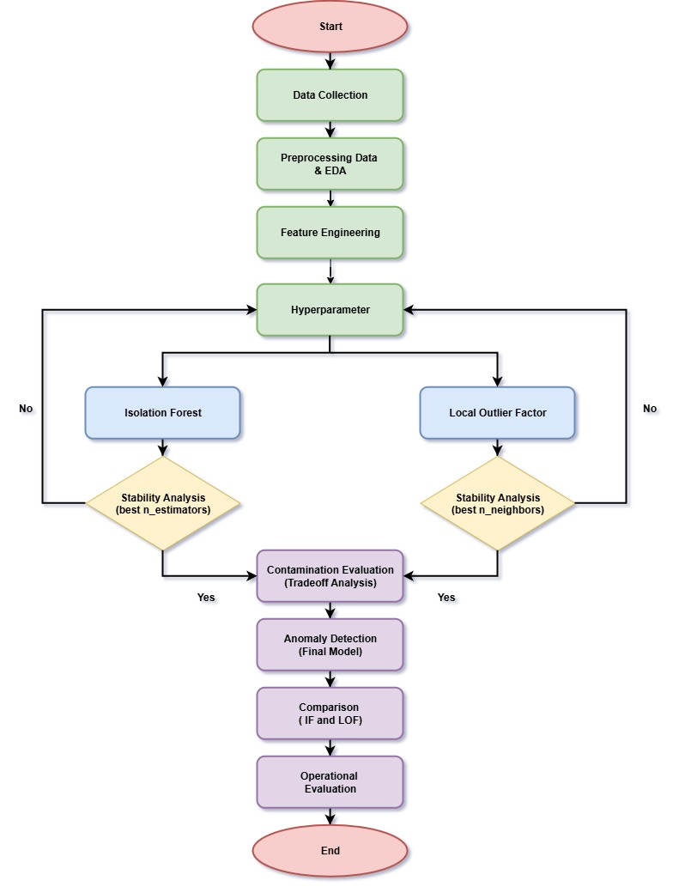

# Multivariate CEMS Anomaly Detection in the Cement Industry

## Project Overview

This project focuses on detecting multivariate anomalies in Continuous Emission Monitoring System (CEMS) data from the Raw Mill unit of PT Semen Indonesia. The project applies two unsupervised anomaly detection methods, Isolation Forest (IF) and Local Outlier Factor (LOF), to identify unusual patterns in emission and operational variables.

The CEMS dataset contains hourly observations collected over one year, consisting of six variables related to emission and operating conditions. Since the dataset is unlabeled, anomaly detection was performed using an unsupervised learning approach without predefined anomaly labels.

The project covers the complete data science workflow, including data preprocessing, exploratory data analysis, feature engineering, sliding-window transformation, model development, hyperparameter selection, anomaly detection, model comparison, and anomaly severity analysis.

---

## Objectives

The main objectives of this project are:

- Detect anomalous patterns in multivariate CEMS data.
- Apply and compare Isolation Forest and Local Outlier Factor.
- Investigate the sensitivity of model parameters, particularly the contamination level.
- Select stable model configurations using stability analysis.
- Analyze the overlap and differences between IF and LOF anomaly detections.
- Identify variables that contribute strongly to detected anomalous patterns.
- Analyze the daily severity of detected anomalies to provide a more operational interpretation.

---

## Dataset

The dataset was collected from the Continuous Emission Monitoring System (CEMS) of the Raw Mill unit.

### Dataset Characteristics

| Attribute | Description |
|---|---|
| Data Source | CEMS – Raw Mill |
| Observation Period | January–December 2025 |
| Frequency | Hourly |
| Initial Observations | 8,760 |
| Variables | 6 |
| Data Type | Multivariate Time Series |
| Learning Approach | Unsupervised Learning |
| Ground-Truth Labels | Not Available |

### Variables

The six variables used for anomaly detection are:

- Particulate (mg/Nm³)
- SO₂ (mg/Nm³)
- NOₓ (mg/Nm³)
- CO (mg/Nm³)
- O₂ (%)
- Flowrate (m/s)

These variables represent a combination of emission and operational characteristics of the cement production process.

---

## Project Workflow



The following sections describe each stage of the workflow, from data preprocessing to the final anomaly analysis and key findings.

---

## 1. Data Preprocessing

The preprocessing stage was performed to prepare the CEMS data for subsequent analysis and modeling.

The preprocessing workflow included:

- Integrating monthly CEMS datasets into a unified dataset.
- Cleaning and validating the collected observations.
- Removing invalid or non-operational observations.
- Handling missing values.
- Replacing invalid zero values with missing values where appropriate.
- Performing time-based interpolation for selected variables.
- Standardizing timestamp formats.
- Preparing the final dataset for exploratory analysis and modeling.

The preprocessing process was implemented using Python and related data-processing libraries.

---

## 2. Exploratory Data Analysis

Exploratory Data Analysis (EDA) was performed to understand the characteristics and relationships within the CEMS data before applying anomaly detection models.

The analysis included:

- Descriptive statistics.
- Distribution analysis.
- Histograms.
- Boxplots.
- Time-series visualization.
- Correlation analysis.
- Correlation heatmaps.
- Identification of potential relationships between emission and operational variables.

The EDA stage was used to understand the normal behavior, distribution, and variability of the monitored variables.

---

## 3. Feature Engineering

### Data Standardization

The six CEMS variables were standardized before applying the sliding-window transformation so that differences in measurement scales would not dominate the anomaly detection process.

## 3. Feature Engineering

### Data Standardization

The six CEMS variables were standardized before applying the sliding-window transformation so that differences in measurement scales would not dominate the anomaly detection process.

### 24-Hour Sliding Window

A 24-hour sliding window was used to capture temporal patterns across one day.

For each modeling observation, 24 consecutive hourly observations were combined into a single window.

The initial dataset contained 8,760 hourly observations. With a window size of 24, the transformation generated:

- **8,737 sliding windows**
- **144 features per window**

Each window contains:

```text
24 hours × 6 variables = 144 features
```

## 4. Anomaly Detection Methods

Two unsupervised anomaly detection algorithms were applied to identify potentially abnormal patterns in the multivariate CEMS data: **Isolation Forest** and **Local Outlier Factor (LOF)**.

* Isolation Forest

Isolation Forest identifies anomalies based on how easily observations can be isolated from the rest of the dataset.

The algorithm constructs multiple isolation trees and evaluates the path length required to isolate each observation. Observations that are isolated more easily tend to have shorter path lengths and are therefore considered more likely to be anomalous.

In this project, Isolation Forest was used to detect **globally unusual deviations** within the multivariate temporal patterns of the CEMS data.

* Local Outlier Factor

Local Outlier Factor (LOF) identifies anomalies by comparing the local density of an observation with the density of its neighboring observations.

An observation with substantially lower local density than its surrounding observations tends to receive a higher LOF value and is considered more likely to be anomalous.

In this project, LOF was used as a complementary approach to Isolation Forest because it focuses on **local deviations relative to neighboring observations**.

### Why Use Both Methods?

Isolation Forest and LOF provide complementary perspectives on anomaly detection.

- **Isolation Forest** focuses on observations that are globally distinct from the overall data structure.
- **LOF** focuses on observations that deviate from the local density of their neighboring observations.

Using both approaches allows the project to compare different types of anomalous behavior within the multivariate CEMS data.

## 5. Hyperparameter Selection

Hyperparameter selection was performed using **stability analysis** to evaluate the consistency of anomaly detection results under different model configurations.

Because the dataset does not contain ground-truth anomaly labels, conventional supervised evaluation metrics such as accuracy, precision, recall, and F1-score could not be directly used for hyperparameter selection.

Instead, the **Jaccard Similarity coefficient** was used to measure the similarity between anomaly sets generated under different configurations. A higher Jaccard Similarity indicates greater consistency in the detected anomaly set.

### Isolation Forest

The number of estimators was evaluated using **50, 100, 200, and 300 estimators**.

The resulting mean Jaccard Similarities were:

| `n_estimators` | Mean Jaccard Similarity |
|---:|---:|
| 50 | 0.6507 |
| 100 | 0.7279 |
| 200 | 0.7771 |
| 300 | **0.8562** |

The highest stability was obtained with:

**`n_estimators = 300`**

Therefore, **300 estimators** were selected for the final Isolation Forest model.

### Local Outlier Factor

The number of neighbors was evaluated using **10, 20, 30, and 40 neighbors**.

The resulting mean Jaccard Similarities were:

| `n_neighbors` | Mean Jaccard Similarity |
|---:|---:|
| 10 | 0.9927 |
| 20 | 0.9941 |
| 30 | **0.9968** |
| 40 | 0.9950 |

The highest stability was obtained with:

**`n_neighbors = 30`**

Therefore, **30 neighbors** were selected for the final Local Outlier Factor model.

## 6. Contamination Evaluation

The contamination parameter was evaluated using several candidate values:

**0.01, 0.02, 0.03, 0.05, and 0.07**

The contamination parameter determines the expected proportion of observations treated as anomalies by the model.

The evaluation considered the stability of anomaly detection results and the consistency of anomaly overlap between the two methods.

The final contamination level was selected as:

```text
contamination = 0.05
```

## 7. Final Model Configuration

Based on the hyperparameter stability and contamination evaluation, the final anomaly detection models were configured as follows:

| Model | Parameter | Selected Value |
|---|---|---:|
| Isolation Forest | `n_estimators` | 300 |
| Isolation Forest | `contamination` | 0.05 |
| Local Outlier Factor | `n_neighbors` | 30 |
| Local Outlier Factor | `contamination` | 0.05 |

## 8. Anomaly Detection Results

After applying the selected model configurations, both methods detected:

**437 anomalies** from **8,737 sliding-window observations**, corresponding to approximately **5% of the modeling observations**.

### Detection Overlap

The anomaly sets generated by Isolation Forest and LOF were compared to identify observations detected by both methods and observations detected exclusively by one method.

| Detection Category | Observations |
|---|---:|
| Isolation Forest Only | 339 |
| LOF Only | 339 |
| Detected by Both Methods | **98** |
| Total Anomalies Detected by Each Model | **437** |


The **98 observations detected by both methods** represent the strongest agreement between the two anomaly detection approaches.

Because the problem is unsupervised and no ground-truth anomaly labels are available, these observations should be interpreted as **high-agreement anomaly candidates**, rather than confirmed real-world anomalies.

---


## 9. Anomaly Severity Analysis

To provide an additional operational perspective, the detected anomaly observations were aggregated by day.

The severity categories were defined based on the number of detected anomalies per day:

| Severity | Anomalies per Day | Interpretation |
|---|---:|---|
| Normal | 0 | No detected anomaly |
| Early Warning | 1–5 | Initial indication of abnormal behavior |
| Process Disturbance | 6–10 | More frequent deviation that may indicate process disturbance |
| Critical Operating Condition | ≥11 | High concentration of anomalous observations |

These categories are **research-specific operational interpretations** and do not represent standardized industrial severity levels.

### Daily Anomaly Characteristics

The daily anomaly analysis produced:

- **365 observation days**
- **Mean:** 1.20 anomalies/day
- **Standard deviation:** 4.40 anomalies/day
- **Maximum:** 24 anomalies/day
- **Days with zero detected anomalies:** 328

This analysis provides an additional perspective by showing not only whether an observation is anomalous, but also how frequently anomalous observations occur within a day.

---

## 10. Operational Analysis

The detected anomalies were further analyzed to identify which variables were most strongly associated with the anomalous patterns identified by each model.

### Isolation Forest

The variable most strongly associated with the anomalies detected by Isolation Forest was:

**SO₂**

### Local Outlier Factor

The variable most strongly associated with the anomalies detected by LOF was:

**NOₓ**

The difference in dominant variables suggests that the two algorithms capture different characteristics of abnormal behavior.

Isolation Forest tends to identify observations that are globally distinct from the overall data structure, while LOF focuses on observations that deviate from the local density of their neighboring observations.

---

## 11. Correlation Insights

Correlation analysis provided additional context for interpreting the multivariate relationships within the CEMS data.

One of the strongest relationships observed was between **NOₓ and CO**, with correlations of:

- **0.79** in the Isolation Forest analysis.
- **0.70** in the LOF analysis.

This indicates that NOₓ and CO tend to vary together within the observed data and may reflect related combustion-process behavior.

Other notable relationships included:

| Variable Pair | Isolation Forest | LOF |
|---|---:|---:|
| NOₓ – CO | 0.79 | 0.70 |
| SO₂ – O₂ | 0.62 | 0.79 |
| SO₂ – CO | -0.46 | -0.45 |
| SO₂ – NOₓ | -0.39 | -0.48 |

These correlations describe statistical relationships within the dataset and should not be interpreted as direct causal relationships.

---

## 12. Key Findings

The main findings of this project are:

1. A **24-hour sliding-window transformation** converted the hourly CEMS time series into multivariate temporal features for anomaly detection.
2. **Isolation Forest** achieved its highest detection stability using **300 estimators**.
3. **Local Outlier Factor** achieved its highest detection stability using **30 neighbors**.
4. A **5% contamination level** was selected based on stability and anomaly-overlap considerations.
5. Both methods detected **437 anomalous observations** from **8,737 modeling observations**.
6. **98 observations** were simultaneously identified as anomalous by both methods.
7. **SO₂** was the dominant variable associated with the anomalies detected by Isolation Forest.
8. **NOₓ** was the dominant variable associated with the anomalies detected by LOF.
9. The results demonstrate complementary characteristics between global and local anomaly detection approaches.
10. Daily severity analysis provides an additional operational perspective by identifying periods with higher concentrations of anomalous observations.

## 13. Visualizations

Selected visualization outputs are available in the [`results/visualizations/`](results/visualizations/) directory.

The project includes visualizations covering:

- Variable distributions.
- Boxplots for identifying distribution and potential outliers.
- Correlation heatmaps.
- Multivariate time-series patterns.
- Anomaly distribution over time.
- Daily anomaly severity.
- Isolation Forest and LOF comparison.
- Explained variance analysis.

## 14. Technologies

The project was developed using the following technologies and tools:

- **Python**
- **Pandas**
- **NumPy**
- **Scikit-learn**
- **Matplotlib**
- **Seaborn**
- **Jupyter Notebook**
- **Git & GitHub**

### Core Data Science Techniques

- Data preprocessing and cleaning
- Exploratory Data Analysis (EDA)
- Data standardization
- Feature engineering
- 24-hour sliding-window transformation
- Multivariate time-series analysis
- Unsupervised anomaly detection
- Isolation Forest
- Local Outlier Factor (LOF)
- Hyperparameter sensitivity analysis
- Stability analysis
- Jaccard Similarity analysis
- Principal Component Analysis (PCA)
- Correlation analysis
- Anomaly severity analysis

## 15. Data Privacy

The original CEMS dataset is not publicly included in this repository because it originates from an industrial monitoring system and contains proprietary information.

To maintain data confidentiality, the repository focuses on:

- Data-processing methodology.
- Modeling workflow.
- Reproducible code structure.
- Visualization outputs.
- Analysis methodology.
- Documentation of the experimental process.

Any confidential, sensitive, or proprietary industrial information has been excluded from the public repository.

## 16. Limitations

Several limitations should be considered when interpreting the results:

- The dataset does not contain ground-truth anomaly labels.
- Model performance therefore cannot be evaluated using conventional supervised classification metrics.
- The contamination parameter represents a modeling assumption used for anomaly identification and does not indicate that all detected observations are confirmed real-world anomalies.
- The severity categories are research-specific and do not represent standardized industrial thresholds.
- The detected anomalies require further validation using process knowledge, operational records, or domain-expert assessment.
- The 24-hour sliding-window transformation increases the dimensionality of the modeling dataset and may cause neighboring windows to contain overlapping information.

## 17. Conclusion

This project demonstrates the application of **unsupervised machine learning** for multivariate anomaly detection in industrial CEMS data.

By combining **Isolation Forest** and **Local Outlier Factor (LOF)**, the project identifies potentially anomalous temporal patterns across multiple emission and operational variables without requiring labeled anomaly data.

Stability-based hyperparameter selection resulted in **300 estimators for Isolation Forest** and **30 neighbors for LOF**, with a final contamination level of **5%**. Both models detected **437 anomalous sliding-window observations**, with **98 observations identified by both methods**.

The results demonstrate that different anomaly detection algorithms can provide **complementary perspectives on abnormal process behavior**. This highlights the value of combining global and local anomaly detection approaches when analyzing complex multivariate industrial time-series data.

## Author

**Helga Fadhil Raditya**

Data Science — Telkom University Surabaya

This project is part of my undergraduate research on
multivariate anomaly detection in cement-industry CEMS data,
exploring the application of unsupervised machine learning
to identify potentially anomalous process patterns.
